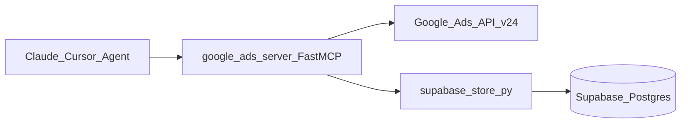

# Supabase AI Memory and Reporting Backend

## Current state

The MCP server is a single FastMCP app in `[google_ads_server.py](google_ads_server.py)` (~1,600 lines). All Google Ads data is fetched live from the API and returned as strings; **nothing is persisted** beyond OAuth token files.

Your choices:

- **Memory:** client/account context **and** session insights (recommendations, audit notes, decisions)
- **Writes:** **explicit MCP tools only** (agent decides when to save/recall)

## Target architecture




- Google Ads tools stay unchanged (no hooks in `run_gaql`, `get_campaign_performance`, etc.).
- New `**supabase_store.py**` module owns the Supabase client and SQL/REST operations.
- Thin `**@mcp.tool()**` wrappers in `google_ads_server.py` (or a small `memory_tools.py` imported at startup) expose memory/reporting to the agent.

## Supabase schema (initial migration)

Create SQL under `[supabase/migrations/001_initial.sql](supabase/migrations/001_initial.sql)` (run via Supabase Dashboard SQL editor or CLI):


| Table                | Purpose                                                                                                                                                                                                                                               |
| -------------------- | ----------------------------------------------------------------------------------------------------------------------------------------------------------------------------------------------------------------------------------------------------- |
| `google_ads_clients` | One row per `customer_id` (10-digit string, unique). Columns: `descriptive_name`, `currency_code`, `aliases` (jsonb array), `notes` (text), `metadata` (jsonb), timestamps.                                                                           |
| `memory_entries`     | Session insights and structured context. Columns: `client_id` (nullable FK), `entry_type` (`context`                                                                                                                                                  |
| `report_snapshots`   | Reporting backend. Columns: `client_id` (FK), `report_type` (e.g. `campaign_performance`, `weekly_summary`, `custom_gaql`), `period_start`, `period_end`, `metrics` (jsonb — normalized totals + optional row array), `summary` (text), `created_at`. |


Indexes:

- `google_ads_clients(customer_id)` unique
- `memory_entries(client_id, created_at DESC)`
- `memory_entries` GIN on `tags` (optional)
- `report_snapshots(client_id, period_start, period_end)`

**RLS:** Enable RLS on all tables with a default deny policy for `anon`/`authenticated`. The MCP server uses the **service role key** (server-side only, never in client config) which bypasses RLS—appropriate for a trusted backend MCP. Document that a future multi-user UI would add `org_id` + policies.

**No pgvector in v1** — recall uses `customer_id`, client name/alias match, `tags`, and `ILIKE` on `title`/`content`. Semantic search can be a follow-up.

## New MCP tools (explicit persistence)


| Tool                    | Behavior                                                                                                                                |
| ----------------------- | --------------------------------------------------------------------------------------------------------------------------------------- |
| `save_client_context`   | Upsert by `customer_id`. Args: `customer_id`, `descriptive_name`, optional `currency_code`, `aliases`, `notes`, `metadata`.             |
| `recall_client_context` | Lookup by `customer_id` **or** fuzzy match on `descriptive_name` / `aliases`. Returns profile + recent `memory_entries`.                |
| `save_memory`           | Insert `memory_entries`. Args: `content`, `entry_type`, optional `customer_id`, `title`, `tags`, `source`.                              |
| `search_memory`         | Filter by `customer_id`, `entry_type`, `tags`, date range, keyword (`q`). Limit + order by `created_at DESC`.                           |
| `save_report_snapshot`  | Insert `report_snapshots`. Args: `customer_id`, `report_type`, `period_start`, `period_end`, `metrics` (dict/JSON), optional `summary`. |
| `list_report_snapshots` | List/compare snapshots for a client; optional `report_type` and date filters.                                                           |


All tools return **JSON strings** (consistent with structured recall) and fail clearly if Supabase env vars are missing (`SUPABASE_NOT_CONFIGURED` message).

Optional convenience (low cost): `link_client_from_google_ads` — calls existing `execute_gaql_query` for `customer.descriptive_name` then `save_client_context` in one step (still explicit invocation).

## Code layout (minimal refactor)

```
mcp-google-ads/
├── supabase/
│   └── migrations/
│       └── 001_initial.sql
├── supabase_store.py      # Supabase client singleton, CRUD, error handling
├── memory_tools.py        # @mcp.tool definitions (import mcp from google_ads_server)
└── google_ads_server.py   # import memory_tools at end to register tools
```

**Why split files:** `google_ads_server.py` is already large; keeping DB logic out preserves readability and testability.

**Client library:** Add `supabase>=2.0` to `[pyproject.toml](pyproject.toml)` and `[requirements.txt](requirements.txt)`. Use sync client inside async tools (simple `async def` wrappers that call sync Supabase SDK—matches existing `requests`-based style).

Example store helper shape:

```python
# supabase_store.py
def get_client() -> Client:
    url = os.environ["SUPABASE_URL"]
    key = os.environ["SUPABASE_SERVICE_ROLE_KEY"]
    ...

def upsert_client(customer_id: str, **fields) -> dict: ...
def insert_memory(**fields) -> dict: ...
```

## Configuration

Extend `[.env.example](.env.example)`:

```bash
SUPABASE_URL=https://xxxx.supabase.co
SUPABASE_SERVICE_ROLE_KEY=eyJ...   # server only; Railway secret
# Optional: SUPABASE_ANON_KEY only if you add a future browser UI
```

- **Local:** `.env` via existing `load_dotenv()`.
- **Railway:** Add both vars as encrypted environment variables (same pattern as `GOOGLE_ADS_CREDENTIALS_JSON`).

Supabase is **optional at runtime**: if vars are unset, Google Ads tools work; memory tools return a single actionable error.

## Agent workflow (how memory + reporting get used)

1. **First time on a client:** `list_accounts` + GAQL name lookup → `save_client_context` with aliases (e.g. "EyeRIS" ↔ account name).
2. **After analysis:** `save_memory` with `entry_type=insight` or `decision` (e.g. "Paused Campaign X — CPA 3x target").
3. **Weekly report:** Pull live data with existing tools → `save_report_snapshot` with normalized `metrics` + executive `summary`.
4. **Next session:** `recall_client_context` + `search_memory` before re-auditing; `list_report_snapshots` for period-over-period.

This aligns with your [cross-channel-ads-report](file:///Users/shivpanks/.cursor/skills/cross-channel-ads-report/SKILL.md) workflow without coupling Meta into this repo (Meta MCP could use the same Supabase project later with a `platform` column if desired).

## Supabase project setup (one-time, manual)

1. Create project at [supabase.com](https://supabase.com).
2. Run `001_initial.sql` in SQL Editor.
3. Copy **Project URL** and **service_role** key (Settings → API).
4. Add env vars locally and on Railway.

## Testing

- Unit-style tests in `[test_supabase_store.py](test_supabase_store.py)` with mocked Supabase client (no live DB required in CI).
- Manual smoke: call `save_client_context` → `recall_client_context` → `save_memory` → `search_memory` via Cursor MCP.

## Security notes

- Never commit service role key; gitignore `.env`.
- Service role key grants full DB access—treat like `GOOGLE_ADS_CREDENTIALS_JSON`.
- Do not expose memory tools on a public MCP URL without auth middleware (your Railway deployment is already a consideration).

## Out of scope (follow-ups)

- Auto-persist on `get_campaign_performance` / `run_gaql`
- pgvector / embedding-based `search_memory`
- Supabase Edge Functions or scheduled cron ETL
- Meta cross-channel tables (add `platform` column later if needed)

